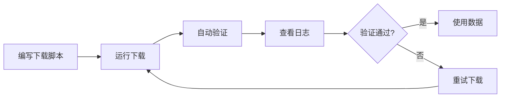

# 项目结构说明

ERA5-Land 数据自动下载工具的项目结构和文件说明。

## 📁 项目目录结构

```
ERA5-Land-Downloader/
│
├── 📄 README.md                              # 主文档（完整使用说明）
├── 📄 QUICKSTART.md                          # 快速开始指南
├── 📄 VARIABLES.md                           # 变量参考文档
├── 📄 PROJECT_STRUCTURE.md                   # 本文件
├── 📄 requirements.txt                       # Python依赖列表
│
├── 🐍 download_ERA5_Land.py                  # 核心下载模块
├── 🐍 quick_start_example.py                # 快速开始示例
├── 🐍 download_ERA5_Land_with_config.py     # 配置文件下载
├── 🐍 manage_downloads.py                   # 下载管理工具
├── 🐍 setup_cdsapi.py                       # CDS API配置助手
│
└── 📋 download_config.json                   # 配置文件示例
```

## 📄 文档文件

### README.md
**主文档** - 完整的使用说明和参考文档

包含内容：
- 功能特点
- 安装配置
- 详细使用方法
- 数据验证说明
- 高级功能
- 常见问题
- 完整示例

适合人群：所有用户，特别是需要详细了解功能的用户

### QUICKSTART.md
**快速开始指南** - 5分钟快速上手

包含内容：
- 三步快速开始
- 最简单的代码示例
- 常用场景示例
- 快速故障排查

适合人群：新用户，想快速开始使用的用户

### VARIABLES.md
**变量参考文档** - ERA5-Land可用变量列表

包含内容：
- 完整的变量列表
- 变量名映射关系
- 变量单位和说明
- 变量使用示例

适合人群：需要查询特定变量的用户

### PROJECT_STRUCTURE.md
**项目结构说明** - 本文件

包含内容：
- 项目目录结构
- 各文件功能说明
- 使用流程图

适合人群：想了解项目结构的用户，开发者

## 🐍 Python文件

### download_ERA5_Land.py
**核心下载模块** - 主要功能实现

功能：
- `ERA5LandDownloader` 类：核心下载器
- 自动下载、验证、重试
- 并行下载支持
- 完整的数据验证
- 日志记录

使用方式：
```python
from download_ERA5_Land import ERA5LandDownloader
downloader = ERA5LandDownloader()
```

### quick_start_example.py
**快速开始示例** - 交互式示例程序

功能：
- 6个预设示例场景
- 交互式菜单选择
- 完整的示例代码
- 数据读取和处理示例

使用方式：
```bash
python quick_start_example.py
```

### download_ERA5_Land_with_config.py
**配置文件下载** - 使用JSON配置文件下载

功能：
- 从JSON文件读取配置
- 批量下载支持
- 适合自动化任务

使用方式：
```bash
python download_ERA5_Land_with_config.py download_config.json
```

### manage_downloads.py
**下载管理工具** - 管理下载任务

功能：
- 查看下载状态
- 重试失败的下载
- 清理临时文件
- 查看验证日志

使用方式：
```bash
python manage_downloads.py status    # 查看状态
python manage_downloads.py retry     # 重试失败
python manage_downloads.py clean     # 清理临时文件
```

### setup_cdsapi.py
**CDS API配置助手** - 交互式配置CDS API

功能：
- 交互式输入UID和API Key
- 自动创建配置文件
- 验证配置是否正确

使用方式：
```bash
python setup_cdsapi.py
```

## 📋 配置文件

### requirements.txt
**Python依赖列表**

内容：
```
cdsapi>=0.5.1
xarray>=2023.1.0
netCDF4>=1.6.0
pandas>=2.0.0
tqdm>=4.65.0
```

使用方式：
```bash
pip install -r requirements.txt
```

### download_config.json
**配置文件示例**

用途：
- 配置文件下载的示例
- 可以复制修改后使用

示例内容：
```json
{
  "output_dir": "./data/china_2014",
  "max_workers": 5,
  "variables": ["2m_temperature"],
  "start_date": "2014-01-01",
  "end_date": "2014-12-31",
  "area": [60, 70, 10, 140]
}
```

## 🗂️ 运行时生成的文件

### 输出目录结构

```
<output_dir>/
├── logs/
│   ├── download_status.json      # 下载状态记录
│   └── verification_log.txt      # 验证日志
├── temp/                          # 临时文件目录
└── ERA5_Land_*.nc                # 下载的数据文件
```

### download_status.json
**下载状态记录**

内容：
- 每个任务的下载状态
- 文件路径
- 时间戳
- 错误信息（如果失败）

### verification_log.txt
**验证日志**

内容：
- 文件验证详细过程
- 变量检查结果
- 时间空间范围验证
- 数据完整性统计

## 🔄 使用流程

### 流程1: 首次使用


1. `pip install -r requirements.txt`
2. `python setup_cdsapi.py`
3. `python quick_start_example.py`
4. 查看输出目录和日志

### 流程2: 日常使用



### 流程3: 批量下载


1. 编辑 `download_config.json`
2. `python download_ERA5_Land_with_config.py download_config.json`
3. 查看 `logs/verification_log.txt`

## 📊 核心类和方法

### ERA5LandDownloader 类

```python
class ERA5LandDownloader:
    def __init__(self, output_dir, max_workers, retry_times, 
                 retry_delay, variable_mapping)
    
    def download(self, variables, start_date, end_date, 
                 area, time_hours, split_by, merge_files)
    
    def retry_failed_downloads(self)
    
    def merge_netcdf_files(self, file_list, output_name)
    
    # 内部方法
    def _verify_file(self, file_path, expected_variables, task)
    def _log_verification(self, message, level)
```

### 主要方法说明

| 方法 | 功能 | 返回值 |
|------|------|--------|
| `download()` | 下载数据 | 文件路径列表 |
| `retry_failed_downloads()` | 重试失败的下载 | 成功下载的文件列表 |
| `merge_netcdf_files()` | 合并多个NetCDF文件 | 合并后的文件路径 |

## 🎯 推荐使用路径

### 新手用户
1. 阅读 `QUICKSTART.md`
2. 运行 `python setup_cdsapi.py`
3. 运行 `python quick_start_example.py`
4. 查看生成的数据和日志

### 进阶用户
1. 阅读 `README.md` 完整文档
2. 参考 `VARIABLES.md` 选择变量
3. 编写自己的下载脚本
4. 使用 `manage_downloads.py` 管理下载

### 批量下载
1. 准备 `download_config.json`
2. 运行 `python download_ERA5_Land_with_config.py`
3. 使用 `manage_downloads.py` 查看状态

## 📝 注意事项

1. **不要修改核心文件**: `download_ERA5_Land.py` 是核心模块，除非必要不要修改
2. **保留日志文件**: `verification_log.txt` 记录了重要的验证信息
3. **定期清理**: 使用 `manage_downloads.py clean` 清理临时文件
4. **备份配置**: 如果修改了 `download_config.json`，建议备份

## 🔧 开发者信息

### 扩展功能

如需扩展功能，主要修改以下文件：
- `download_ERA5_Land.py`: 核心功能
- `quick_start_example.py`: 添加新示例
- `manage_downloads.py`: 添加管理功能

### 添加新变量映射

在 `download_ERA5_Land.py` 中的 `DEFAULT_VARIABLE_MAPPING` 字典添加：
```python
DEFAULT_VARIABLE_MAPPING = {
    'your_cds_variable': 'netcdf_variable',
    # ...
}
```

---

## 📚 相关资源

- [ERA5-Land 数据集](https://cds.climate.copernicus.eu/cdsapp#!/dataset/reanalysis-era5-land)
- [CDS API 文档](https://cds.climate.copernicus.eu/api-how-to)
- [xarray 文档](https://docs.xarray.dev/)

---

**版本**: v2.1  
**更新日期**: 2025-12-23

